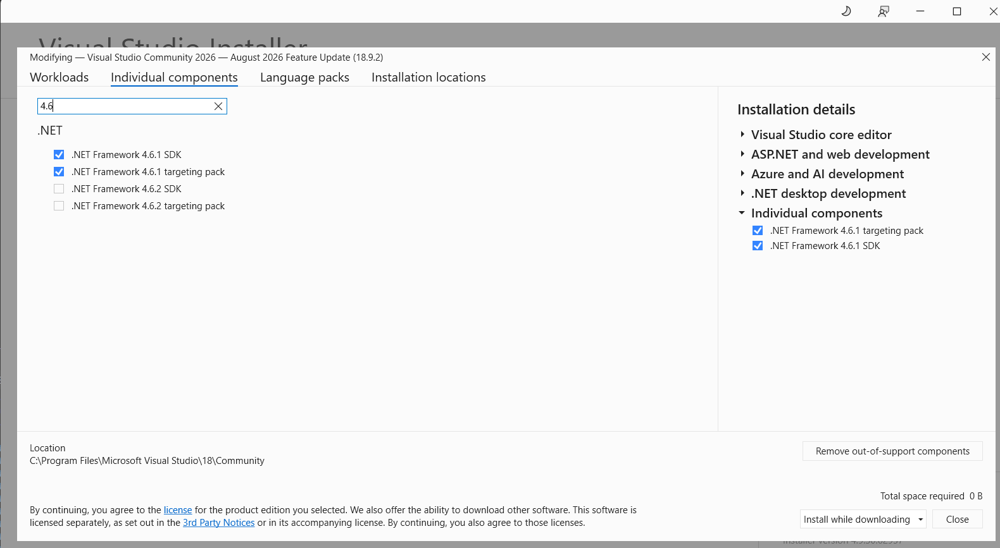

# Dealertrack Developer Workstation Setup

This repo automates most of the DTN dev machine setup. For the full walkthrough with screenshots, see the [wiki page](https://trader.atlassian.net/wiki/spaces/DE/pages/4212031615).

## Quick Start

Open a **Command Prompt as Administrator**, then:

**1. Clone this repo:**

> **⚠ Important:** You **must** run `git lfs install` before `git clone`. This repo contains ~1.8 GB of large files tracked by Git LFS (Oracle installers, wwwroot.zip). If you clone without LFS, those files will be tiny pointer files and the setup will fail.
>
> If you already cloned without LFS: run `git lfs install` then `git lfs pull` from the repo directory to fetch the real files.

```
mkdir C:\dtnsourcecode
cd C:\dtnsourcecode
git lfs install
git clone https://github.com/vit100-trader/dev-workstation-setup.git
```

> If Git or Git LFS aren't installed yet, the script will install them via `winget` on Step 4/5. In that case, just download the repo as a ZIP from GitHub, extract it, and run the script. It will install Git and LFS, then you can re-run it to clone the repos properly.

**2. Install the Oracle client** (must be done before the script so `tnsnames.ora` gets copied automatically):

- Extract `oracle\win32_11gR2_client.zip` from the cloned repo (32-bit is the required one)
- Run `setup.exe` from the extracted `client` folder
- Select **Custom** install, set Oracle Base to `C:\Oracle`
- See [wiki screenshots](https://trader.atlassian.net/wiki/spaces/DE/pages/4212031615) for each installer step

**3. Run the script:**

```
cd dev-workstation-setup
setup.bat
```

> **Windows Home** does not support IIS. You need Windows Pro or Enterprise.

## What the Script Does

| Step | What happens |
|---|---|
| winget check | Detects whether `winget` is available for automatic installs |
| Create directories | `C:\dtnsourcecode` and `C:\tools` |
| PATH | Adds `C:\tools` to system PATH |
| Git | Installs Git via winget if missing |
| Git LFS | Installs Git LFS via winget if missing, runs `git lfs install` |
| Clone repos | Clones all 50 repos from `tdr-dealertrack` (skips existing) |
| IIS + MSMQ | Enables IIS and MSMQ features via DISM |
| App pools | Adds each pool from `iis/apppools.xml` independently via appcmd; existing pools are skipped |
| Sites | Removes Default Web Site, imports `iis/sites.xml` |
| wwwroot | Extracts `wwwroot.zip` to `C:\inetpub\` |
| machine.config | Creates timestamped backups of the original, then copies all 3 configs |
| tnsnames.ora | Copies to Oracle client dir |
| hosts | Adds `localhostcgw` entry |
| NuGet | Downloads `nuget.exe` to `C:\tools` |
| PDF Upload Tool | Extracts to `C:\tools\PdfUploadTool` |
| Posting Tool | Extracts to `C:\tools\PostingTool` |
| AWS VPN Client | Installs via winget if missing |

Every step checks what's already in place and skips it, so you can safely re-run the script. But a full re-run may overwrite existing configuration. In particular, `machine.config` is backed up and replaced, while `tnsnames.ora` is replaced without a backup.

## After the Script

### machine.config — update loginid

Open the machine.config files and replace the `<loginid>` value with your own username. Two alternatives are included as comments: `auser8417` (automation testing) and `dtcndevall` (DTN admin) — uncomment one of those instead if needed.

The files live at:

```
C:\Windows\Microsoft.NET\Framework\v2.0.50727\CONFIG\machine.config
C:\Windows\Microsoft.NET\Framework64\v2.0.50727\CONFIG\machine.config
C:\Windows\Microsoft.NET\Framework\v4.0.30319\Config\machine.config
```

### JFrog NuGet Source

`nuget.exe` is already in `C:\tools`. Now configure the feed:

1. Sign in at [JFrog](https://traderca.jfrog.io) with SAML SSO
2. Generate an API key (top-right > Edit Profile)
3. Run:

```
nuget source add -Name "dtncan-nuget-local" -Source "https://traderca.jfrog.io/artifactory/api/nuget/v3/dtncan-nuget-local" -Username YOUR_EMAIL -Password YOUR_API_KEY
```

### VPN — import profiles

The script installs the AWS VPN Client. You still need to import your connection profiles:

1. Go to the [self-service portal](https://self-service.clientvpn.amazonaws.com/) and download `.ovpn` files
2. In the VPN client, import them via File > Manage Profiles

See the [AWS VPN Transition to Okta](https://trader.atlassian.net/wiki/spaces/CLOUD/pages/4891476045/AWS+Client+VPN+Transition+to+AS24+Okta+Authentication) page for details.

### Oracle SQL Developer

[Download](https://www.oracle.com/ca-en/database/sqldeveloper/technologies/download/) the Windows version with JDK included. Import connections from `oracle/sqlDeveloperConnections.json` (File > Import Connections, decryption password: `123`).

### PDF Upload Tool

Extracted to `C:\tools\PdfUploadTool\1.0.2.2`. Use the **32-bit version** (must match the Oracle client architecture).

### Posting Tool

Extracted to `C:\tools\PostingTool`. Fakes lender responses so you don't have to wait for real ones during development. See the [DTN.XMLPostingTool repo](https://github.com/tdr-dealertrack/DTN.XMLPostingTool) or ask QA for usage tips.

### Build in Visual Studio

Open `C:\dtnsourcecode\DTN.Core.Base` in Visual Studio **as Admin** and build. If it works, your setup is good.

## Troubleshooting

**Issues with solution not building**

You might need to install certain dotnet versions. This being one of them: https://dotnet.microsoft.com/en-us/download/dotnet-framework/thank-you/net452-developer-pack-offline-installer



These can be found in the Visual Studio Installer and are also required

**Windows Home — no IIS:** IIS requires Windows Pro or Enterprise. Windows Home does not have it.

**Git LFS files missing:** If large files (Oracle installers, wwwroot.zip) are tiny (~130 bytes) pointer files instead of the real binaries:

1. Install Git LFS if you haven't: `winget install GitHub.GitLFS`
2. Run `git lfs install` (one-time per machine)
3. From the repo directory, run `git lfs pull` to download the real files
4. Re-run `setup.bat` — the script also auto-detects LFS pointers and runs `git lfs pull` for you

**Oracle install — use "Oracle" not "Oracle86":** The script expects `C:\Oracle\product\11.2.0\client_1`. If you accidentally installed to a different path, either reinstall or update the `ORA_DIR` variable in `setup.bat`.

> All repos must live under `C:\dtnsourcecode`. The IIS sites config (`sites.xml`) has hardcoded paths pointing there.
